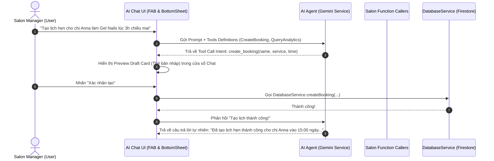

# Kế hoạch Kiến trúc & Tích hợp AI Agent cho iOS Salon App (Updated)

## 1. Tổng quan & Đánh giá giải pháp (Architecture Decision)

### Tại sao chọn Cloud LLM (Gemini API Free Tier) thay vì On-Device Local LLM?
* **On-Device Local LLM (Llama 3.2 1B/3B, Gemma 2B):**
  * ❌ Làm tăng dung lượng app thêm **1.5 GB - 2.5 GB**.
  * ❌ Tiêu tốn Pin và RAM của iPhone (yêu cầu máy cấu hình mạnh).
  * ❌ Trích xuất dữ liệu structured (Function Calling / Tool Use) dễ bị sai lệch logic khi tạo lịch/hoá đơn.
* **Cloud API Free Tier (Google Gemini 1.5 Flash / 2.0 Flash qua Google AI Studio / Firebase Vertex AI):**
  * ✅ **0 MB** tăng thêm cho App Size.
  * ✅ **100% Miễn phí** trong hạn mức Free Tier (hàng triệu tokens/tháng, đủ cho salon vừa và nhỏ).
  * ✅ Khả năng **Function Calling chuẩn xác 99%+** đối với tạo Lịch hẹn, truy vấn doanh thu.
  * ✅ Phản hồi siêu nhanh (dưới 1 giây với Gemini Flash).

---

## 2. Phân quyền Premium & Paywall Integration (Input 1)

### Cơ chế Paywall Gatekeeping:
* **Gói tính năng:** AI Chat Agent được xếp vào danh mục tính năng **Premium (Paying Users)**.
* **Luồng xử lý (Control Flow):**
  1. Người dùng bấm vào nút nổi `AIFabButton`.
  2. Hệ thống kiểm tra `subscriptionProvider.isPremium`.
  3. Nếu **Chưa đăng ký Premium (Non-paying user)**: Hiển thị ngay `PaywallBottomSheet.show(context, titleExplanation: "Unlock AI Salon Agent to auto-schedule, analyze revenue & chat with AI")`.
  4. Nếu **Đã đăng ký Premium (Paying user)**: Mở ngay cửa sổ `AIChatBottomSheet`.

```dart
void _onAiFabTapped(BuildContext context) {
  final subProvider = context.read<SubscriptionProvider>();
  if (!subProvider.isPremium) {
    PaywallBottomSheet.show(
      context,
      titleExplanation: "Unlock AI Salon Agent to auto-schedule, analyze revenue & chat with AI",
    );
    return;
  }
  
  // Mở cửa sổ AI Chat cho người dùng Premium
  showModalBottomSheet(
    context: context,
    isScrollControlled: true,
    builder: (context) => const AIChatBottomSheet(),
  );
}
```

---

## 3. Cơ chế Liên kết API Key cá nhân (BYOK - Bring Your Own Key) (Input 2)

### Có nên cho phép liên kết API Key không?
* ✅ **Rất nên!** Đây là tính năng tuyệt vời dành cho Power-Users.
* **Lợi ích:**
  * Giảm 100% chi phí API cho nhà phát triển khi người dùng sử dụng AI với tần suất cực cao.
  * Cho phép người dùng tùy chọn xài các model siêu cấp như **GPT-4o (OpenAI)**, **Claude 3.5 Sonnet (Anthropic)**, hoặc **Gemini 1.5 Pro**.

### Trải nghiệm mượt mà & Đơn giản nhất (Smooth BYOK UX):
1. **Thiết lập trong Settings (`SettingsPage`):**
   * Thêm mục **"AI Provider Settings"**.
   * Chế độ 1: **Default (Salon AI Service)** - Dùng sẵn Gemini Free tích hợp theo gói Premium (Zero setup).
   * Chế độ 2: **Custom API Key** - Chọn Provider (`Google Gemini` / `OpenAI ChatGPT` / `Groq`) và Paste API Key.
2. **Nút Hướng dẫn 1-Tap:**
   * Cung cấp nút *"Lấy API Key miễn phí"* mở trực tiếp trình duyệt đến trang phát sinh Key của Provider (VD: `aistudio.google.com/app/apikey`).
3. **Bảo mật On-Device:**
   * API Key của user được mã hoá và lưu trực tiếp trong thiết bị bằng `flutter_secure_storage`. **Không lưu trên Server** để đảm bảo 100% riêng tư và tạo dựng lòng tin.

---

## 4. Luồng hoạt động & An toàn dữ liệu (Safety & UX Flow)



---

## 5. Danh mục Agent Tools (Phase 1 Scope)

### Group A: Calendar Tools (Quản lý Lịch hẹn)
1. `create_booking_draft`:
   * Parameters: `customerName` (String), `serviceName` (String), `dateTime` (ISO8601 String), `note` (String).
   * UX Action: Hiển thị **Preview Draft Card** -> Người dùng xác nhận trước khi ghi vào Firestore.
2. `get_bookings_by_date`:
   * Parameters: `date` (YYYY-MM-DD).
   * UX Action: Tự động tra cứu `DatabaseService` và trả lời danh sách lịch hẹn trong ngày.

### Group B: Salon Analytics Tools (Báo cáo & Doanh thu)
1. `get_revenue_report`:
   * Parameters: `startDate` (YYYY-MM-DD), `endDate` (YYYY-MM-DD).
   * UX Action: Tổng hợp tổng doanh thu, số hoá đơn, dịch vụ phổ biến nhất và trả về báo cáo ngắn gọn.
2. `get_customer_stats`:
   * Parameters: `queryPeriod` (today | this_week | this_month).
   * UX Action: Thống kê số lượng khách mới, lượt khách quay lại.

---

## 6. Lộ trình triển khai (Implementation Roadmap)

- [ ] **Bước 1: Cấu hình Dependency**: Thêm gói `google_generative_ai: ^0.4.0` & `flutter_secure_storage: ^9.2.2` vào `pubspec.yaml`.
- [ ] **Bước 2: Xây dựng AI Agent Service & Provider Switcher**: Hỗ trợ Gemini Default API và Custom User API Key.
- [ ] **Bước 3: Tích hợp Paywall Gatekeeper**: Kiểm tra `SubscriptionProvider.isPremium` khi người dùng nhấn `AIFabButton`, tự động mở `PaywallBottomSheet` nếu chưa nâng cấp.
- [ ] **Bước 4: Xây dựng UI Chat & Draft Card Component**: 
  - Nút `AIFabButton` xuất hiện ở góc dưới màn hình.
  - `AIChatBottomSheet` hiển thị danh sách tin nhắn và `BookingDraftCard`.
- [ ] **Bước 5: Tích hợp với DatabaseService**: Đấu nối các tool functions với `DatabaseService` sẵn có trong ứng dụng.
- [ ] **Bước 6: Testing & Prompt Tuning**: Thử nghiệm các câu lệnh tự nhiên tiếng Việt / tiếng Anh và tối ưu System Prompt.
