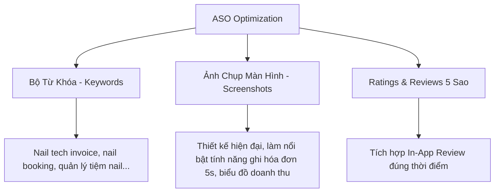

# Chiến Lược Tăng Trưởng & Tactics Thu Hút Người Dùng Cho Nail Management System (NMS)

Chào bạn! Chúc mừng bạn đã được Apple phê duyệt và phát hành ứng dụng tích hợp Subscription lên App Store thành công. Giai đoạn chuyển dịch từ **"Xây dựng sản phẩm" (Product Development)** sang **"Tăng trưởng & Tiếp thị" (Growth & Marketing)** là thử thách lớn nhất của các indie developers.

Với đặc thù của ứng dụng quản lý tiệm/thợ nails (**Nail Management System - NMS**), tệp khách hàng của bạn rất cụ thể (Niche Market) nhưng lại có hành vi số hóa và tính cộng đồng cực kỳ cao (đặc biệt là cộng đồng người Việt làm nails tại Mỹ, Canada, Úc, Anh, v.v.).

Dưới đây là bản phân tích chiến lược (Strategy) và các hành động thực tế (Tactics) cụ thể chia theo các giai đoạn từ **0 đồng (Organic)** đến **Tối ưu sản phẩm (Product-Led Growth)** để bạn có thể áp dụng ngay lập tức nhằm đưa số lượng active users vượt mốc 1.000 UIDs.

---

## 1. Hiểu Rõ Đối Tượng Mục Tiêu & Nỗi Đau (Pain Points)

Để promote hiệu quả, mọi thông điệp của bạn phải đánh trúng nỗi đau của 2 nhóm đối tượng này:

| Đối tượng | Nỗi đau chính | Tính năng của NMS giải quyết |
| :--- | :--- | :--- |
| **Thợ nails độc lập (Booth Renters / Solo Techs)** | - Mất thời gian viết hóa đơn tay giấy tờ. - Quên sở thích khách hàng (màu sơn, kiểu dáng, dị ứng). - Khó tính doanh thu hàng tuần để khai thuế (thu nhập từ tips, tiền mặt/card). | - Ghi hóa đơn nhanh trong 5s trên điện thoại. - Lưu lịch sử chi tiết từng khách hàng. - Báo cáo doanh thu trực quan để khai thuế cuối năm. |
| **Chủ tiệm nails nhỏ (Small Salon Owners)** | - Chi phí phần mềm POS truyền thống quá đắt ($50 - $150+/tháng như Vagaro, Phorest). - Quản lý lịch hẹn lộn xộn, hay bị trùng lịch hoặc khách bùng hẹn (no-shows). | - Giải pháp quản lý tinh gọn, chi phí cực kỳ rẻ (Premium Monthly/Yearly giá hạt dẻ). - Lịch đặt hẹn (Booking Calendar) trực quan. |

---

## 2. Các Tactics "0 Đồng" (Organic Acquisition) - Ưu tiên hàng đầu

Với ngân sách ban đầu hạn chế, bạn nên tập trung 80% công sức vào các kênh miễn phí nhưng có độ tập trung tệp khách hàng cao.

### 📌 Tactic 2.1: Tiếp cận Cộng đồng Người Việt làm Nails tại Nước Ngoài (Facebook Groups)
Cộng đồng người Việt làm nails tại Mỹ, Canada, Úc cực kỳ lớn và họ thường xuyên giao lưu trong các group Facebook.
*   **Hành động cụ thể:**
    1.  Tham gia vào các group lớn như: *Hội Thợ Nail tại Mỹ*, *Nail Tech Secrets*, *Cộng đồng Nail Việt tại Canada*, *Hội chủ tiệm nail ở Úc*, v.v.
    2.  **Đừng đăng bài spam quảng cáo app trực tiếp** (sẽ bị admin xóa bài ngay lập tức).
    3.  **Hành động khôn ngoan:** Đăng bài chia sẻ giá trị dưới dạng "giải quyết vấn đề".
        *   *Ví dụ mẫu đăng bài:* *"Chào mọi người, em thấy nhiều anh chị thợ nail cuối ngày/cuối tuần mệt mỏi vì phải cộng sổ sách tính tiền commission hoặc khai thuế. Em có tự làm một app nhỏ trên iPhone/iPad giúp ghi hóa đơn siêu nhanh, lưu lịch sử khách thích màu gì, tự động vẽ biểu đồ doanh thu. Em tặng miễn phí 3-6 tháng dùng thử cho các anh chị trong group để lấy feedback hoàn thiện app. Anh chị nào cần dùng thử comment dưới bài em gửi code nhé."*
    4.  Khi họ comment, hãy chủ động inbox hướng dẫn nhiệt tình và gửi mã Promo Code (Apple cho phép tạo Promo Codes cho Subscription).

### 📌 Tactic 2.2: Tận dụng Visual Content trên TikTok & Instagram Reels
Nail là ngành công nghiệp hình ảnh (visual-heavy). Thợ nails dành rất nhiều thời gian lướt TikTok/Instagram để xem mẫu nails hoặc xem cuộc sống hàng ngày của các thợ nails khác.
*   **Hành động cụ thể:**
    1.  Tạo tài khoản TikTok/Instagram cho app.
    2.  Làm các video ngắn (dưới 30 giây) tập trung vào sự tương phản (Pain vs. Solution):
        *   *Video 1:* Cảnh thợ nails đang lay hoay viết hóa đơn giấy bằng bút chì, cộng trừ nhầm lẫn ❌ VS. Cảnh dùng app NMS bấm chọn dịch vụ, áp discount, nhấn xuất hóa đơn gửi qua iMessage chuyên nghiệp trong 5 giây ✅.
        *   *Video 2:* Cách thợ nails ghi nhớ 100 sở thích khách hàng bằng tính năng Lịch sử khách hàng trên NMS.
        *   *Video 3:* "Day in the life of a solo nail tech" có lồng ghép cảnh sử dụng app NMS trên iPad đặt trên bàn làm việc.
    3.  Sử dụng hashtags chuẩn: `#nailtechlife`, `#nailtechproblems`, `#salonowner`, `#nailbookingapp`, `#nailinvoices`, `#quảnlýtiệmnail`.

### 📌 Tactic 2.3: Tiếp cận Trực tiếp (Direct Outreach / Local Sales)
*   **Hành động cụ thể:**
    1.  Tìm kiếm các tiệm nails nhỏ quanh khu vực bạn ở (hoặc trên Google Maps ở các thành phố lớn tại Mỹ/Canada).
    2.  Nhắn tin qua Instagram/Facebook Page của họ: *"Chào anh/chị, bên em mới ra mắt ứng dụng quản lý hóa đơn và lịch hẹn chuyên biệt cho tiệm nails. Em thấy tiệm mình rất đẹp và chuyên nghiệp. Bên em muốn tặng tiệm mình gói Premium miễn phí 3 tháng để trải nghiệm và tối ưu hóa vận hành. Nếu anh/chị quan tâm, em xin phép gửi link tải dùng thử ạ."*
    3.  Phản hồi trực tiếp từ 10 chủ tiệm đầu tiên này sẽ giúp bạn hiểu sản phẩm của mình còn thiếu sót gì để sửa nhanh.

---

## 3. Product-Led Growth (Tăng trưởng dựa vào chính sản phẩm)

Đây là cách để app tự nhân bản người dùng (Virality Loop) mà bạn không cần tốn chi phí quảng cáo.

### 🔄 Tactic 3.1: Watermark/Branding trên Hóa đơn chia sẻ (Viral Loop cực mạnh)
Tính năng cốt lõi của app là tạo hóa đơn (Invoice Entry) và gửi/chia sẻ cho khách hàng.
*   **Hành động cụ thể:**
    *   Khi thợ nails gửi hóa đơn cho khách dưới dạng hình ảnh hoặc file PDF, hãy chèn một dòng chữ thương hiệu nhỏ, tinh tế ở phía dưới cùng:
        *   *English:* `Powered by Nail Management System - nms.app`
        *   *Vietnamese:* `Tạo bởi Phần mềm Quản lý Tiệm Nails - NMS`
    *   **Tại sao hiệu quả:** Khách hàng đi làm nails thấy hóa đơn chuyên nghiệp sẽ hỏi thợ, hoặc chính những thợ nails khác khi thấy đồng nghiệp chia sẻ ảnh hóa đơn đẹp mắt lên mạng xã hội sẽ tò mò tìm kiếm tên app của bạn trên App Store.

### 🎁 Tactic 3.2: Chương trình Giới thiệu (Referral Program)
*   **Hành động cụ thể:**
    *   Tạo tính năng: *"Giới thiệu bạn bè - Nhận thêm Premium"*.
    *   Nếu thợ nails A chia sẻ link tải app cho thợ nails B sử dụng, khi thợ B đăng ký tài khoản, cả hai sẽ được tặng thêm **1 tháng Premium miễn phí**.
    *   Tính năng này thúc đẩy truyền miệng (Word-of-mouth) cực kỳ mạnh mẽ trong các tiệm nails nơi các thợ ngồi làm việc cạnh nhau.

---

## 4. Tối ưu hóa chuyển đổi trên App Store (ASO - App Store Optimization)

Để khi người dùng tìm kiếm từ khóa trên App Store, app của bạn sẽ hiển thị đầu tiên và thuyết phục họ tải về.

### 🔍 Tactic 4.1: Tối ưu hóa Từ khóa (Keywords)
Người dùng (đặc biệt là nước ngoài) sẽ tìm gì khi họ cần app của bạn?
*   **Từ khóa chính (Title/Subtitle/Keywords metadata):** `nail tech book`, `nail salon pos`, `nail invoice generator`, `nail client book`, `salon manager`, `quản lý tiệm nail`, `tính tiền nail`.
*   **Hành động:** Đưa các từ khóa này vào Tên ứng dụng (Title) và Mô tả ngắn (Subtitle). Ví dụ: *NMS: Nail Tech Invoice & Book* hoặc *NMS: Quản lý tiệm nail & Lịch*.

### 📱 Tactic 4.2: Thiết kế Ảnh chụp màn hình (Screenshots) chuyên nghiệp
*   Nhiều dev thường chỉ chụp thô giao diện app rồi upload lên App Store. Điều này làm giảm 70% tỷ lệ chuyển đổi tải app (Install Rate).
*   **Hành động:** Sử dụng các công cụ thiết kế (Figma, Canva) để tạo mockup điện thoại/iPad chỉn chu, thêm các dòng caption ngắn bằng tiếng Anh/tiếng Việt nổi bật:
    *   *Màn hình 1:* "Create Nail Invoices in 5 Seconds" (Ảnh tab ghi hóa đơn).
    *   *Màn hình 2:* "Track Client Preferences & History" (Ảnh chi tiết khách hàng).
    *   *Màn hình 3:* "Beautiful Revenue Charts for Tax Season" (Ảnh biểu đồ doanh thu).

### ⭐ Tactic 4.3: Kêu gọi Đánh giá 5 Sao đúng thời điểm (In-App Review)
*   App Store xếp hạng rất cao các app có nhiều đánh giá tốt gần đây.
*   **Hành động:** Sử dụng plugin `in_app_review` của Flutter để hiển thị popup xin đánh giá của Apple.
*   **Thời điểm quan trọng:** Đừng hiển thị ngay khi vừa mở app. Hãy hiển thị vào lúc **"Aha! Moment"** (khoảnh khắc người dùng vui vẻ nhất). Ví dụ: Ngay sau khi họ bấm lưu và gửi thành công hóa đơn thứ 5, hoặc khi họ vừa xem biểu đồ doanh thu tháng đạt mốc cao mới.

---

## 5. Chiến Lược Freemium & Giá Cả (Pricing Strategy)

Hiện tại bạn đang dùng RevenueCat với 2 gói: Monthly (`mysalonapp_premium_monthly`) và Yearly (`mysalonapp_premium_yearly`). Để giảm ma sát (friction) cho người dùng mới:

### 🔓 Tactic 5.1: Cung cấp Free Trial (Dùng thử miễn phí)
*   **Hành động:** Cấu hình trên App Store Connect & RevenueCat cho phép người dùng đăng ký Premium được **dùng thử miễn phí 7 ngày hoặc 14 ngày**.
*   **Tại sao:** Thợ nails rất ngại trả tiền trước khi biết app có thực sự tiện lợi cho công việc hàng ngày của họ không. Free trial giúp họ vượt qua rào cản này.

### 📊 Tactic 5.2: Giới hạn theo mức độ sử dụng thay vì chặn tính năng hoàn toàn
Thay vì khóa hoàn toàn ứng dụng nếu không mua premium, hãy áp dụng mô hình giới hạn số lượng (Usage-based limit):
*   **Gói Miễn Phí (Free):** Cho phép tạo tối đa **10 khách hàng** và **15 hóa đơn/tháng**. Giao diện báo cáo doanh thu cơ bản.
*   **Gói Premium:** Không giới hạn khách hàng, hóa đơn, mở khóa tính năng đính kèm ảnh mẫu móng và báo cáo phân tích nâng cao.
*   Điều này giúp họ sử dụng app lâu dài, tích lũy dữ liệu khách hàng. Khi việc kinh doanh của họ tốt lên, họ sẽ tự động nâng cấp lên Premium mà không ngần ngại.

---

## 6. Ma Trận Ưu Tiên Hành Động (Action Priority Matrix)

Để bạn không bị ngợp, hãy thực hiện theo thứ tự ưu tiên dưới đây:

| Thứ tự | Nhiệm vụ | Độ khó | Tác động (Impact) | Thời gian triển khai |
| :--- | :--- | :--- | :--- | :--- |
| **1** | Cấu hình **Free Trial (7 ngày)** trên App Store & RevenueCat | Dễ | Rất cao | 1 giờ |
| **2** | Tích hợp popup xin **In-App Review** vào lúc lưu hóa đơn thành công | Dễ | Cao | 2 giờ |
| **3** | Thêm **Watermark** tinh tế dưới ảnh hóa đơn xuất ra để gửi khách | Trung bình | Cao | 3 giờ |
| **4** | Viết bài chia sẻ giá trị + tặng coupon Premium trên các **Facebook Groups thợ Nails** | Dễ | Rất cao (Có ngay tập users đầu tiên) | Hàng ngày |
| **5** | Tối ưu hóa **Keywords & Screenshots** trên App Store Connect | Trung bình | Cao | 1 ngày |
| **6** | Quay 3 video ngắn đăng lên **TikTok / Instagram Reels** | Trung bình | Trung bình -> Rất cao (nếu viral) | Hàng tuần |

Chúc bạn thực hiện chiến dịch marketing thành công và sớm có được những khách hàng trả phí đầu tiên! Nếu bạn cần viết code cho phần nào (ví dụ: tích hợp in-app review, thêm watermark vào ảnh hóa đơn, hoặc điều chỉnh UI paywall), hãy báo tôi biết để hỗ trợ ngay nhé!
