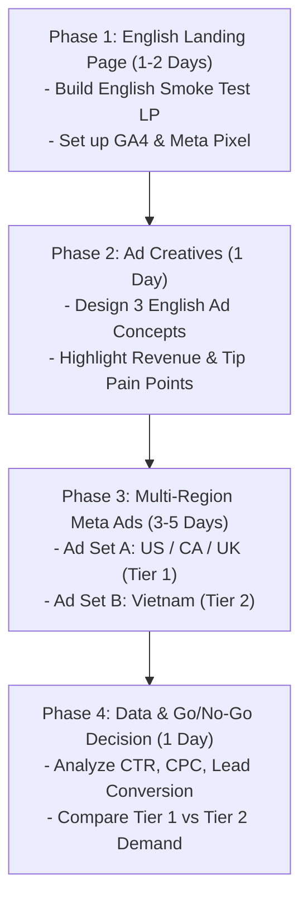

# 🚀 Market Validation Roadmap (Smoke Test) - Nail & Salon Management System (NMS)

## 📌 Updated Strategy Overview
* **Product:** Nail & Salon Management System (NMS).
* **App Language:** 100% English.
* **Target Markets:** US, Canada, UK (Tier 1) & Vietnam (Tier 2).
* **Core Angle:** **Zero-Loss Salon Revenue & Transparent Staff Tip Allocation** ("Zero-loss revenue tracking, instant invoice receipt printing, and transparent tip distribution for salon owners").
* **Campaign Goal:** Drive 300 - 500 targeted English-speaking salon owner clicks via Meta Ads to validate demand & measure Landing Page conversion rate.

---

## 🗓️ 4-Phase Action Plan

---

## 🎨 Phase 1: English Landing Page Structure

### 1. Hero Section (English)
* **Headline:** "Stop Losing Salon Revenue & Tip Disputes – Automated Salon Management Built for Modern Owners"
* **Sub-headline:** "Track daily sales, split technician tips transparently, and print bluetooth receipts in seconds. Simple, affordable, and zero learning curve."
* **Call to Action (CTA):** `Start Free Trial` or `Get Early Beta Access` (Form: Name, Email, Salon Name, Staff Count).

### 2. 3 Core Pain Points & Solutions
1. 🔴 *Manual & Messy Tip Splitting:* $\rightarrow$ 🟢 Automatic tip distribution breakdown per technician (Cash & Card).
2. 🔴 *Daily Revenue Leakage:* $\rightarrow$ 🟢 Instant sales summary reports + Bluetooth receipt printing on mobile.
3. 🔴 *Expensive & Bloated Salon Software ($50-$100+/mo):* $\rightarrow$ 🟢 Lightweight, zero-hassle app with flexible pricing.

---

## 🎯 Phase 2: Meta Ads Setup (English)

### 1. Ad Set Segmentation (Crucial for Budget Control)
Because CPC in US/CA/UK ($0.50 - $2.00) is much higher than Vietnam ($0.05 - $0.15), **you MUST separate them into 2 Ad Sets**:

* **Ad Set A (Tier 1 - US, CA, UK):**
  * **Languages:** English (All).
  * **Interests:** Nail Salon, Beauty Salon, Manicure, Pedicure, Small Business Admins.
  * **Daily Budget:** $10 - $15 / day.
* **Ad Set B (Tier 2 - Vietnam):**
  * **Languages:** English.
  * **Interests:** Salon Owners, Spa Owners, Small Business Admins in Vietnam.
  * **Daily Budget:** $3 - $5 / day.

### 2. 3 English Ad Copy & Creative Angles

#### 🖼️ Concept 1: "The End-of-Day Headache" (Pain Point)
* **Ad Copy:** *"Tired of spending 1 hour after closing to calculate staff tips and track receipts? NMS automates your daily salon reports and tip splits in 30 seconds."*
* **Visual:** Split image showing a messy paper logbook vs. clean NMS App dashboard.

#### 🎥 Concept 2: "Speed & Transparency" (Feature Demo)
* **Ad Copy:** *"Print receipts instantly via Bluetooth & keep staff happy with transparent tip tracking. Built specifically for modern nail & beauty salons."*
* **Visual:** Short 15s video showing bluetooth receipt printing + 1-tap invoice creation.

#### 💡 Concept 3: "Cost Savings" (Value/Price Angle)
* **Ad Copy:** *"Why pay $99/mo for bloated salon software when you only need fast invoicing, tip splitting, and sales tracking? Try NMS free today."*
* **Visual:** Comparison chart: Legacy Software ($99/mo) vs NMS (Simple & Affordable).

---

## 📊 Phase 3 & 4: Budget & Decision Metrics (KPIs)

### Budget Allocation (5-Day Validation Run)
* **Total Estimated Budget:** $65 - $100 total.
  * Tier 1 (US/CA/UK): $10/day $\times$ 5 days = $50
  * Tier 2 (Vietnam): $5/day $\times$ 5 days = $25

### Benchmark KPIs for Validation

| Metric | Target (Tier 1: US/CA/UK) | Target (Tier 2: Vietnam) | Actionable Insight |
| :--- | :--- | :--- | :--- |
| **CTR (Click-Rate)** | $> 2.0\%$ | $> 3.5\%$ | Indicates ad creative resonance. |
| **CPC (Cost/Click)** | $\$0.40 - \$0.90$ | $\$0.05 - \$0.15$ | Ensures ad spend efficiency. |
| **LP Conversion Rate** | $> 8 - 12\%$ | $> 12 - 18\%$ | **Strong Market Demand & Intent!** |
| **Cost / Beta Lead** | $<\$4.00$ | $<\$1.00$ | Cost per acquired salon lead. |
