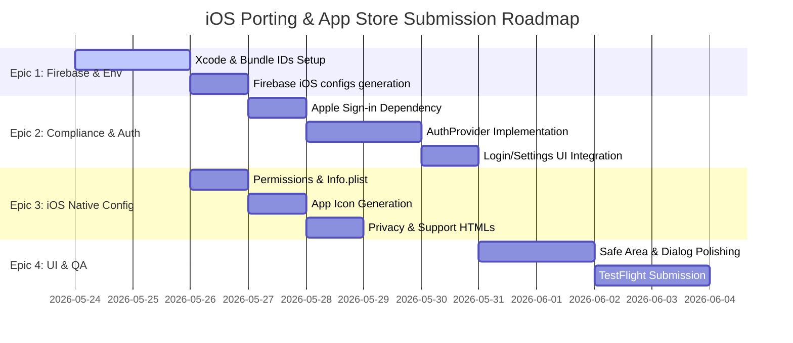

# Porting NMS to iOS and App Store Submission (Milestone 1 MVP)

This plan outlines the Work Breakdown Structure (WBS) and proposed changes to port the Nail Management System (NMS) Flutter app to iOS and submit the first MVP version to the App Store for review.

## User Review Required

> [!IMPORTANT]
> **Firebase Production Setup**:
> You need to register a new iOS App in your production Firebase console (`invoices-management-c4ef0`) with the bundle identifier `com.maibathai.invoice`. Once registered, download its `GoogleService-Info.plist` so we can configure Xcode to dynamically switch between dev and prod configurations.
> 
> **Apple Developer Program**:
> You must have an active Apple Developer account ($99/yr) to configure capabilities like "Sign in with Apple" and submit the app to App Store Connect.

## Work Breakdown Structure (WBS) & Epics



### Epic 1: iOS Core Environment & Firebase Setup [DONE]
- [x] **Task 1.1**: Register `com.maibathai.invoice` in the production Firebase project.
- [x] **Task 1.2**: Update Xcode build configurations to dynamically handle Dev (`com.maibathai.invoice.dev`) and Prod (`com.maibathai.invoice`) bundle identifiers.
- [x] **Task 1.3**: Configure Xcode build phases to copy the correct `GoogleService-Info.plist` (Dev vs Prod) based on the target build configuration.
- [x] **Task 1.4**: Run FlutterFire CLI or update `lib/firebase_options_dev.dart` and `lib/firebase_options_prod.dart` to include the respective iOS App credentials.

### Epic 2: Sign in with Apple & App Store Compliance
- **Task 2.1**: Add `sign_in_with_apple` plugin to [pubspec.yaml](file:///Users/maibathai/Documents/Personal/invoice/pubspec.yaml).
- **Task 2.2**: Enable "Sign in with Apple" capability in the App ID identifier and Xcode project settings.
- **Task 2.3**: Update [auth_provider.dart](file:///Users/maibathai/Documents/Personal/invoice/lib/core/providers/auth_provider.dart) with the Sign in with Apple authentication flow (linking credentials if the current session is anonymous, or signing in directly).
- **Task 2.4**: Update the UI to display the Sign in with Apple button on iOS devices.

### Epic 3: iOS Native Configurations, Permissions & Assets
- **Task 3.1**: Configure [Info.plist](file:///Users/maibathai/Documents/Personal/invoice/ios/Runner/Info.plist) with required permission descriptions for photo library and camera:
  - `NSCameraUsageDescription` (for capturing nail work photos)
  - `NSPhotoLibraryUsageDescription` (for selecting existing work photos)
- **Task 3.2**: Configure and run `flutter_launcher_icons` using the newly provided icon `assets/icons/my_salon_icon.png`.
- **Task 3.3**: Create static templates [privacy.html](file:///Users/maibathai/Documents/Personal/invoice/web/privacy.html) and [support.html](file:///Users/maibathai/Documents/Personal/invoice/web/support.html) in the web folder for hosting on Firebase Hosting.
- **Task 3.4**: Create a standard Apple Privacy Manifest (`PrivacyInfo.xcprivacy`) detailing key usage reasons and data collection practices.

### Epic 4: UI Polishing & Safe Area Support
- **Task 4.1**: Audit screens on an iOS Simulator/device for safe areas (especially dynamic notch heights and the bottom home indicator).
- **Task 4.2**: Verify that the VietQR feature gracefully hides the Bank Settings and QR codes when non-VND currencies are configured (already implemented but needs physical iOS verification).

### Epic 5: App Store Connect & TestFlight Submission
- **Task 5.1**: Build iOS release bundle using `flutter build ipa`.
- **Task 5.2**: Set up App Store Connect app record, upload screenshots, complete details (including Privacy Policy and Support links).
- **Task 5.3**: Push the first archive to TestFlight for developer testing and external review.

---

## Proposed Changes

### Configuration
#### [MODIFY] [pubspec.yaml](file:///Users/maibathai/Documents/Personal/invoice/pubspec.yaml)
- Add `sign_in_with_apple: ^6.1.1` (or latest compatible version) to dependencies.
- Add `flutter_launcher_icons: ^0.13.1` to dev_dependencies.
- Configure launcher icons block:
  ```yaml
  flutter_launcher_icons:
    android: false
    ios: true
    image_path: "assets/icons/my_salon_icon.png"
  ```

#### [MODIFY] [Info.plist](file:///Users/maibathai/Documents/Personal/invoice/ios/Runner/Info.plist)
- Add camera and photo library usage descriptions.
- Register Google Sign-In Reversed Client ID URL scheme for iOS.

#### [NEW] [privacy.html](file:///Users/maibathai/Documents/Personal/invoice/web/privacy.html)
- Standard privacy policy text explaining local storage, optional anonymous authentication, and Firestore cloud storage.

#### [NEW] [support.html](file:///Users/maibathai/Documents/Personal/invoice/web/support.html)
- Quick customer service and feedback form/contact email page.

#### [NEW] [PrivacyInfo.xcprivacy](file:///Users/maibathai/Documents/Personal/invoice/ios/Runner/PrivacyInfo.xcprivacy)
- Required manifest declaring API types (e.g. File Timestamp, User Defaults) and purpose.

### Authentication & Providers
#### [MODIFY] [auth_provider.dart](file:///Users/maibathai/Documents/Personal/invoice/lib/core/providers/auth_provider.dart)
- Implement `signInWithApple()` using the Apple ID credential.
- Update `signInSilently()` to support iOS keychain-based session restoring.

---

## Verification Plan

### Automated Verification
- Run `flutter analyze` to verify that there are no syntax or type issues after adding the new packages.
- Run `flutter build ios --no-codesign` (or with dev profiles) to verify compile-time errors.

### Manual Verification
- Deploy to an iOS Simulator: Verify Google Sign-In and Sign in with Apple flows.
- Test camera access and image selection on simulator/device.
- Deploy the web templates and verify that the Privacy/Support URLs are reachable over Firebase Hosting.
