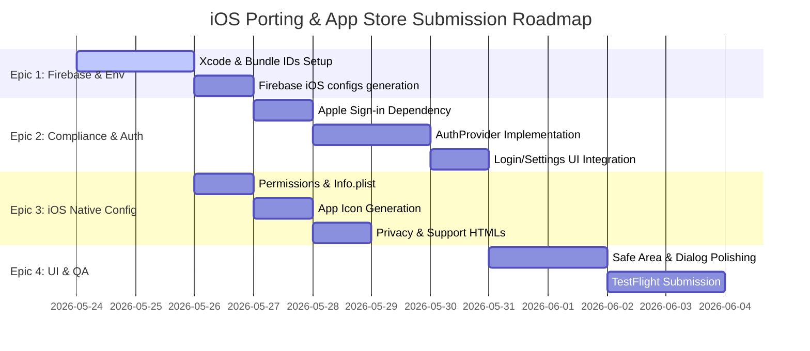

# Porting NMS to iOS and App Store Submission (Milestone 1 MVP)

This plan outlines the Work Breakdown Structure (WBS) and proposed changes to port the Nail Management System (NMS) Flutter app to iOS and submit the first MVP version to the App Store for review.

## User Review Required

> [!IMPORTANT]
> **Firebase Production Setup**:
> You need to register a new iOS App in your production Firebase console (`invoices-management-c4ef0`) with the bundle identifier `com.maibathai.invoice`. Once registered, download its `GoogleService-Info.plist` so we can configure Xcode to dynamically switch between dev and prod configurations.
> 
> **Apple Developer Program**:
> You must have an active Apple Developer account ($99/yr) to configure capabilities like "Sign in with Apple" and submit the app to App Store Connect.

## Work Breakdown Structure (WBS) & Epics



### Epic 1: iOS Core Environment & Firebase Setup [DONE]
- [x] **Task 1.1**: Register `com.maibathai.invoice` in the production Firebase project.
- [x] **Task 1.2**: Update Xcode build configurations to dynamically handle Dev (`com.maibathai.invoice.dev`) and Prod (`com.maibathai.invoice`) bundle identifiers.
- [x] **Task 1.3**: Configure Xcode build phases to copy the correct `GoogleService-Info.plist` (Dev vs Prod) based on the target build configuration.
- [x] **Task 1.4**: Run FlutterFire CLI or update `lib/firebase_options_dev.dart` and `lib/firebase_options_prod.dart` to include the respective iOS App credentials.

### Epic 2: Sign in with Apple & App Store Compliance [DONE]
- [x] **Task 2.1**: Add `sign_in_with_apple` plugin to [pubspec.yaml](file:///Users/maibathai/Documents/Personal/invoice/pubspec.yaml).
- [x] **Task 2.2**: Enable "Sign in with Apple" capability in the App ID identifier and Xcode project settings.
- [x] **Task 2.3**: Update [auth_provider.dart](file:///Users/maibathai/Documents/Personal/invoice/lib/core/providers/auth_provider.dart) with the Sign in with Apple authentication flow (linking credentials if the current session is anonymous, or signing in directly).
- [x] **Task 2.4**: Update the UI to display the Sign in with Apple button on iOS devices.

### Epic 3: iOS Native Configurations, Permissions & Assets [DONE]
- [x] **Task 3.1**: Configure [Info.plist](file:///Users/maibathai/Documents/Personal/invoice/ios/Runner/Info.plist) with localized, generic permission descriptions for photo library and camera:
  - `NSCameraUsageDescription` (for capturing product photos)
  - `NSPhotoLibraryUsageDescription` (for selecting existing product photos)
- [x] **Task 3.2**: Configure and run `flutter_launcher_icons` using the newly provided icon `assets/icons/my_salon_icon.png`.
- [x] **Task 3.3**: Create static templates [privacy.html](file:///Users/maibathai/Documents/Personal/invoice/web/privacy.html) and [support.html](file:///Users/maibathai/Documents/Personal/invoice/web/support.html) in the web folder for hosting on Firebase Hosting.
- [x] **Task 3.4**: Create a standard Apple Privacy Manifest (`PrivacyInfo.xcprivacy`) detailing key usage reasons and data collection practices.

### Epic 4: UI Polishing & Safe Area Support [DONE]
- [x] **Task 4.1**: Wrap views and dialogs dynamically in `SafeArea` where needed (such as settings lists or custom dialogs), while keeping the app-wide background gradients (like `AppLoadingScreen`) full-bleed.
- [x] **Task 4.2**: Implement keyboard tap-outside-to-dismiss UX by wrapping top-level pages (like `InvoicePage` and `ExpensesPage`) and major dialog inputs in a `GestureDetector` that unfocuses active text inputs when tapping empty space.
- [x] **Task 4.3**: Add `share_plus` and `path_provider` dependencies and implement native iOS image sharing (Share Sheet) in `InvoiceSummaryDialog` as a fallback to web downloads.
- [x] **Task 4.4**: Implement platform-adapted camera/gallery prompt sheet (`CupertinoActionSheet` on iOS, Material `ModalBottomSheet` on other platforms) when uploading work photos.
- [x] **Task 4.5**: Change `InvoiceSummaryDialog` from a fixed `SizedBox(width: 450)` to a responsive `ConstrainedBox(constraints: BoxConstraints(maxWidth: 450))` to prevent layout clipping on smaller iPhone screen sizes.
- [x] **Task 4.6**: Verify that the VietQR feature gracefully hides the Bank Settings and QR codes when non-VND currencies (e.g. USD) are configured.

### Epic 5: App Store Connect & TestFlight Submission
- [ ] **Task 5.1**: Configure Team ID (`SGSV6FFW8J`) and Automatic Signing in Xcode project configurations.
- [ ] **Task 5.2**: Register App ID and create App Store Connect record.
- [ ] **Task 5.3**: Compile iOS production release bundle using `flutter build ipa --flavor prod`.
- [ ] **Task 5.4**: Upload the bundle to App Store Connect using Transporter and verify TestFlight distribution.

---

## Proposed Changes

### Configuration
#### [MODIFY] [pubspec.yaml](file:///Users/maibathai/Documents/Personal/invoice/pubspec.yaml)
- Add `sign_in_with_apple: ^6.1.1` (or latest compatible version) to dependencies.
- Add `share_plus: ^6.3.0` and `path_provider: ^2.1.3` to dependencies.
- Add `flutter_launcher_icons: ^0.13.1` to dev_dependencies.
- Configure launcher icons block:
  ```yaml
  flutter_launcher_icons:
    android: false
    ios: true
    image_path: "assets/icons/my_salon_icon.png"
  ```

#### [MODIFY] [Info.plist](file:///Users/maibathai/Documents/Personal/invoice/ios/Runner/Info.plist)
- Add camera and photo library usage descriptions.
- Register Google Sign-In Reversed Client ID URL scheme for iOS.

#### [NEW] [privacy.html](file:///Users/maibathai/Documents/Personal/invoice/web/privacy.html)
- Standard privacy policy text explaining local storage, optional anonymous authentication, and Firestore cloud storage.

#### [NEW] [support.html](file:///Users/maibathai/Documents/Personal/invoice/web/support.html)
- Quick customer service and feedback form/contact email page.

#### [NEW] [PrivacyInfo.xcprivacy](file:///Users/maibathai/Documents/Personal/invoice/ios/Runner/PrivacyInfo.xcprivacy)
- Required manifest declaring API types (e.g. File Timestamp, User Defaults) and purpose.

### Authentication & Providers
#### [MODIFY] [auth_provider.dart](file:///Users/maibathai/Documents/Personal/invoice/lib/core/providers/auth_provider.dart)
- Implement `signInWithApple()` using the Apple ID credential.
- Update `signInSilently()` to support iOS keychain-based session restoring.

### Epic 4 - UI, Photo Picker, & Sharing Changes
#### [MODIFY] [customer_provider.dart](file:///Users/maibathai/Documents/Personal/invoice/lib/core/providers/customer_provider.dart)
- Modify `uploadPhotoForInvoice(String invoiceId, String customerId)` to accept a parameter for `ImageSource source` (instead of hardcoding `.gallery`).

#### [MODIFY] [invoice_summary_dialog.dart](file:///Users/maibathai/Documents/Personal/invoice/lib/features/invoice/widgets/invoice_summary_dialog.dart)
- Convert fixed `SizedBox(width: 450)` wrapper to `ConstrainedBox(constraints: BoxConstraints(maxWidth: 450))` to handle narrower mobile screens gracefully.
- Update `_saveInvoiceImage()` to detect platform. If running on native mobile platforms (iOS/Android), write PNG bytes to a temporary file using `path_provider` and call `Share.shareXFiles(...)` from `share_plus` to invoke the native iOS Share Sheet.
- Modify `_showPhotoPrompt(...)` to trigger a platform-adapted selection sheet before picking the image:
  - On iOS: Use `showCupertinoModalPopup` with `CupertinoActionSheet` showing "Take Photo (Camera)" and "Choose from Library (Gallery)" options.
  - On other platforms: Use `showModalBottomSheet` with Material list items.

#### [MODIFY] [invoice_page.dart](file:///Users/maibathai/Documents/Personal/invoice/lib/features/invoice/invoice_page.dart) and [expenses_page.dart](file:///Users/maibathai/Documents/Personal/invoice/lib/features/expenses/expenses_page.dart)
- Wrap the main scaffold/view in a `GestureDetector` with `onTap: () => FocusScope.of(context).unfocus()` to dismiss active keyboard instances when tapping empty space.

---

## Verification Plan

### Automated Verification
- Run `flutter analyze` to verify that there are no syntax or type issues after adding the new packages.
- Run `flutter build ios --no-codesign` (or with dev profiles) to verify compile-time errors.

### Manual Verification
- **Safe Area & Responsive Layout**:
  - Launch the app on an iOS simulator (e.g., iPhone 15 Pro). Verify that dialogs (like `InvoiceSummaryDialog`) fit correctly on the screen width and do not cause horizontal overflow layout issues.
- **Native Sharing**:
  - Trigger "REVIEW INVOICE" and tap the "Save/Download" button. Verify that the native iOS Share Sheet opens containing the correct PNG image of the invoice.
- **Cupertino Action Sheet**:
  - Save an invoice, then tap "Take Photo" in the prompt. Verify that the native-looking Cupertino selection sheet pops up at the bottom of the screen.
  - Test choosing "Camera" and verify the camera opens (on simulator it will open the mock camera, on device it opens the real camera).
  - Test choosing "Gallery" and verify the photos picker opens.
- **Keyboard Dismissal**:
  - Tap a text input (e.g., Price field). Verify that tapping on any empty/non-interactive background area immediately dismisses the software keyboard.
- **VietQR Currency Filtering**:
  - Go to settings, change currency to `$`. Verify that the VietQR card disappears from the settings screen. Open the invoice summary and verify no QR code card is rendered.
  - Change currency back to `k`. Verify that settings show the bank card, and the invoice dialog displays the QR code payment block.
