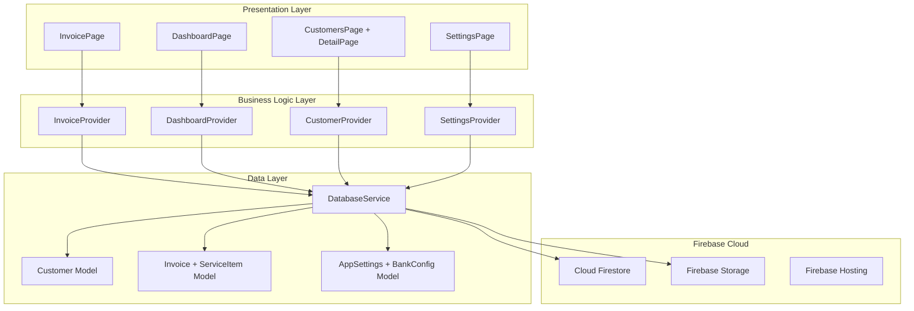
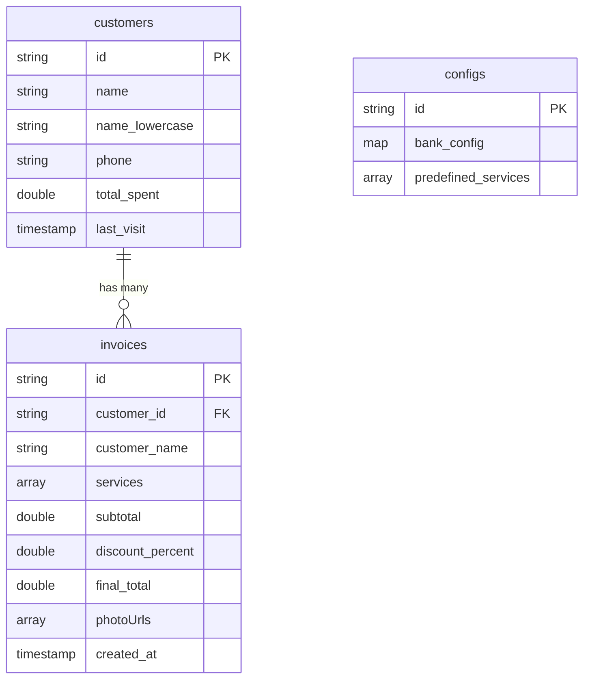
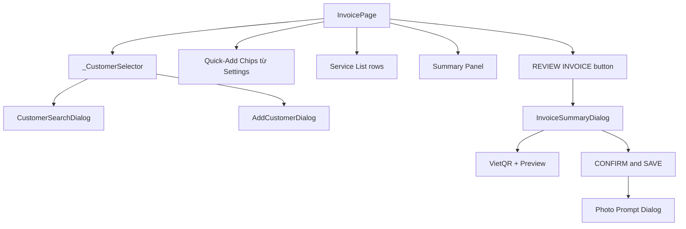
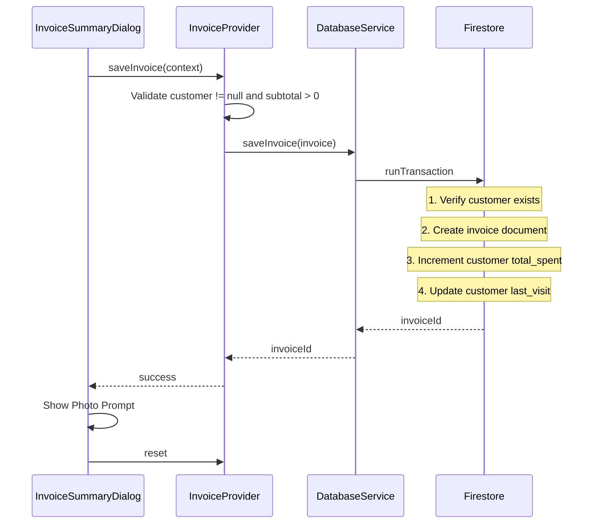
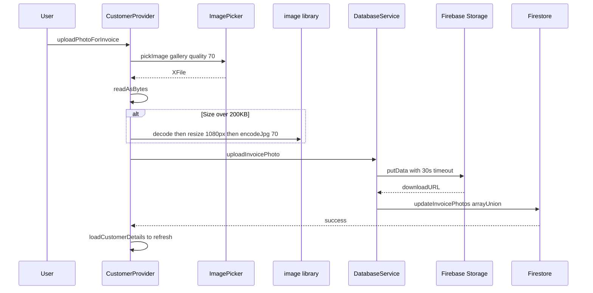
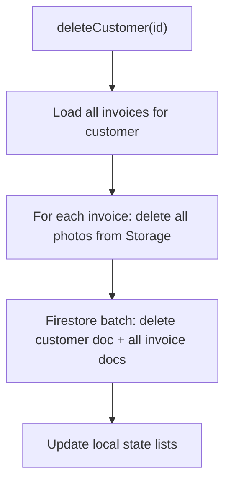
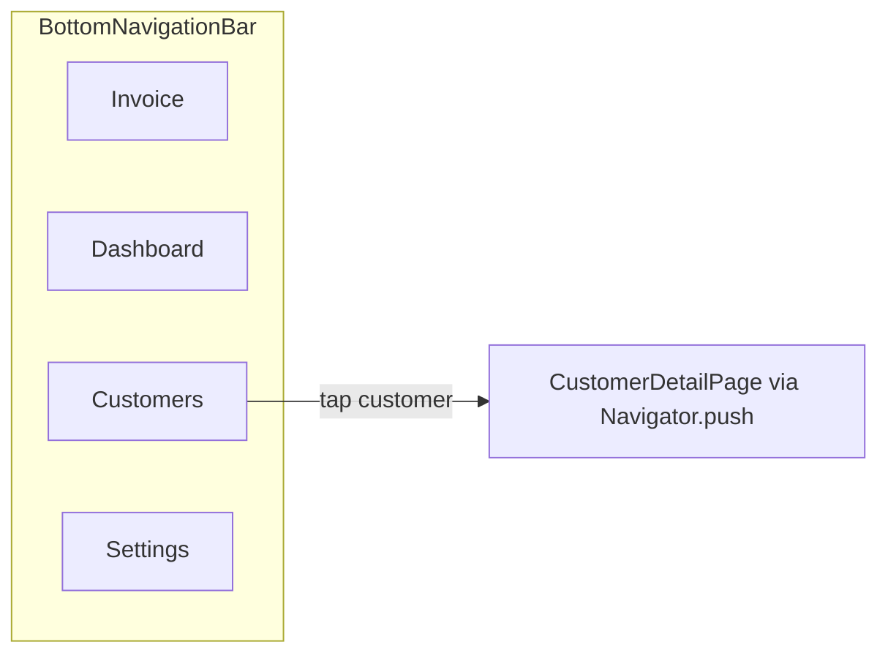

# Tài Liệu Hệ Thống — Nail Management System (NMS) v1.3.6

> **Mục đích**: Tài liệu tham khảo toàn diện từ tổng quan đến chi tiết, giúp hiểu rõ kiến trúc, luồng kỹ thuật, và luồng người dùng của ứng dụng NMS.

---

## 1. Tổng Quan Hệ Thống

| Thuộc tính | Giá trị |
|---|---|
| **Tên dự án** | Nail Management System (NMS) |
| **Phiên bản** | v1.3.6 |
| **Mục tiêu** | Công cụ quản lý cá nhân zero-cost cho tiệm nail: theo dõi doanh thu, lịch sử khách hàng, xuất hóa đơn với QR thanh toán |
| **Nền tảng chính** | Flutter Web (PWA) |
| **Nền tảng phụ** | iOS/iPadOS (native build, chưa cấu hình Firebase) |
| **Backend** | Firebase (Firestore, Storage, Hosting) |
| **Firebase Project** | `invoices-management-c4ef0` |

---

## 2. Tech Stack

### 2.1 Frontend
| Công nghệ | Phiên bản | Vai trò |
|---|---|---|
| **Flutter** | SDK ≥3.0.0 <4.0.0 | Framework UI đa nền tảng |
| **Dart** | (bundled với Flutter) | Ngôn ngữ lập trình chính |
| **Material Design 3** | `useMaterial3: true` | Hệ thống thiết kế UI |
| **Provider** | ^6.0.5 | State management (ChangeNotifier pattern) |
| **fl_chart** | ^1.2.0 | Biểu đồ cột doanh thu |
| **intl** | ^0.20.2 | Định dạng số, ngày tháng |
| **image_picker** | ^1.0.4 | Chọn ảnh từ gallery |
| **image** | ^4.1.3 | Nén/resize ảnh phía client |

### 2.2 Backend (Firebase)
| Dịch vụ | Vai trò |
|---|---|
| **Cloud Firestore** (`^6.3.0`) | NoSQL database — lưu customers, invoices, configs |
| **Firebase Storage** (`^13.3.0`) | Lưu trữ ảnh (nail work photos) |
| **Firebase Hosting** | Deploy PWA (serve `build/web`) |
| **Firebase Core** (`^4.7.0`) | SDK khởi tạo Firebase |

### 2.3 Tích hợp bên ngoài
| Dịch vụ | Vai trò |
|---|---|
| **VietQR API** (`img.vietqr.io`) | Sinh mã QR thanh toán ngân hàng tự động trên hóa đơn |

---

## 3. Kiến Trúc Hệ Thống



**Kiến trúc 3 lớp:**
1. **Presentation Layer** — Các trang UI và widget, chỉ quan tâm hiển thị
2. **Business Logic Layer** — Providers chứa state và logic nghiệp vụ
3. **Data Layer** — Models + DatabaseService trực tiếp tương tác Firebase

---

## 4. Cấu Trúc Thư Mục

```
lib/
├── main.dart                          # Entry point, MultiProvider setup, Navigation
├── firebase_options.dart              # Firebase config (auto-generated)
├── core/
│   └── providers/
│       ├── invoice_provider.dart      # State: tạo hóa đơn, tìm khách hàng
│       ├── dashboard_provider.dart    # State: thống kê doanh thu, biểu đồ
│       ├── customer_provider.dart     # State: CRUD khách hàng, upload ảnh
│       └── settings_provider.dart     # State: cấu hình dịch vụ, ngân hàng
├── data/
│   ├── models/
│   │   ├── customer_model.dart        # Customer entity
│   │   ├── invoice_model.dart         # Invoice + ServiceItem entities
│   │   └── app_settings_model.dart    # AppSettings + BankConfig entities
│   └── services/
│       └── database_service.dart      # Firestore + Storage CRUD operations
└── features/
    ├── invoice/
    │   ├── invoice_page.dart          # Tab 1: Ghi hóa đơn
    │   └── widgets/
    │       ├── customer_search_dialog.dart
    │       ├── add_customer_dialog.dart
    │       └── invoice_summary_dialog.dart
    ├── dashboard/
    │   ├── dashboard_page.dart        # Tab 2: Thống kê doanh thu
    │   └── widgets/
    │       ├── daily_invoices_dialog.dart
    │       └── customer_history_dialog.dart
    ├── customers/
    │   ├── customers_page.dart        # Tab 3: Danh sách khách hàng
    │   └── customer_detail_page.dart  # Chi tiết: invoices + photos
    └── settings/
        └── settings_page.dart         # Tab 4: Cấu hình
```

---

## 5. Data Models

### 5.1 Customer
| Field | Type | Ghi chú |
|---|---|---|
| `id` | String | Auto-generated bởi Firestore |
| `name` | String | Tên khách hàng |
| `name_lowercase` | String | Tên viết thường, dùng cho tìm kiếm |
| `phone` | String | Số điện thoại |
| `total_spent` | double | Tổng chi tiêu tích lũy (đơn vị: k VND) |
| `last_visit` | Timestamp? | Lần ghé gần nhất |

> [!NOTE]
> `name_lowercase` được tự động sinh khi tạo/cập nhật customer, phục vụ Firestore range query cho tìm kiếm case-insensitive.

### 5.2 Invoice và ServiceItem

**ServiceItem** (embedded object trong Invoice):
| Field | Type |
|---|---|
| `service_name` | String |
| `price` | double |

**Invoice**:
| Field | Type | Ghi chú |
|---|---|---|
| `id` | String | Auto-generated |
| `customer_id` | String | FK tham chiếu tới customers |
| `customer_name` | String | Denormalized để hiển thị nhanh |
| `services` | Array of ServiceItem | Danh sách dịch vụ |
| `subtotal` | double | Tổng trước giảm giá |
| `discount_percent` | double | % giảm giá (mặc định 0) |
| `final_total` | double | Tổng sau giảm giá |
| `photoUrls` | Array of String | URLs ảnh trên Firebase Storage |
| `created_at` | Timestamp | Thời điểm tạo |

### 5.3 AppSettings và BankConfig

**BankConfig** (embedded trong AppSettings):
| Field | Type | Default |
|---|---|---|
| `bank_name` | String | "MB Bank" |
| `account_number` | String | "0902994602" |
| `account_name` | String | "VO THI BICH BAO" |

**AppSettings**:
| Field | Type |
|---|---|
| `bank_config` | BankConfig |
| `predefined_services` | Array of ServiceItem |

---

## 6. Firestore Schema



| Collection | Document ID | Mô tả |
|---|---|---|
| `customers` | auto-generated | Mỗi doc = 1 khách hàng |
| `invoices` | auto-generated | Mỗi doc = 1 hóa đơn, liên kết qua `customer_id` |
| `configs` | `app_settings` | Singleton document chứa cấu hình app |

**Firebase Storage path:**
```
customers/{customerId}/invoices/{invoiceId}/{timestamp}.jpg
```

---

## 7. State Management — Chi Tiết Providers

### 7.1 InvoiceProvider
**Trách nhiệm:** Quản lý toàn bộ flow tạo hóa đơn mới.

| State | Type | Mô tả |
|---|---|---|
| `selectedCustomer` | Customer? | Khách hàng đang chọn |
| `services` | List of ServiceItem | Danh sách dịch vụ trong hóa đơn |
| `discountPercent` | double | Phần trăm giảm giá |
| `searchResults` | List of Customer | Kết quả tìm kiếm khách |
| `isSaving` | bool | Trạng thái đang lưu |
| `resetCounter` | int | Force UI refresh sau khi reset |

**Computed properties:**
- `subtotal` = tổng price của tất cả services
- `finalTotal` = subtotal × (1 - discount/100)

**Tính năng đặc biệt — Vietnamese diacritics search:**
Hàm `_normalizeAndRemoveDiacritics()` chuyển ký tự có dấu thành không dấu (`àáạảã` → `a`, `đ` → `d`) và strip combining marks (`\u0300-\u036f`) để xử lý NFD encoding trên Mac/iOS. Tìm kiếm chạy trên in-memory cache, không gọi Firestore mỗi lần gõ.

### 7.2 DashboardProvider
**Trách nhiệm:** Tính toán thống kê doanh thu.

| State | Type | Mô tả |
|---|---|---|
| `todayRevenue` | double | Doanh thu hôm nay |
| `monthRevenue` | double | Doanh thu tháng này |
| `yearRevenue` | double | Doanh thu năm nay |
| `last7DaysRevenue` | List of 7 doubles | Doanh thu mỗi ngày trong 7 ngày qua |
| `dailyInvoices` | List of 7 invoice lists | Hóa đơn theo từng ngày |

**Logic:** Fetch tất cả invoices từ `startOfYear`, rồi phân loại vào các bucket thống kê trong 1 lần duyệt duy nhất (O(n)).

### 7.3 CustomerProvider
**Trách nhiệm:** CRUD khách hàng, quản lý ảnh.

| Method | Mô tả |
|---|---|
| `loadCustomers()` | Fetch toàn bộ danh sách khách hàng |
| `searchCustomers()` | Tìm kiếm local (diacritics-aware) |
| `loadCustomerDetails()` | Load customer + tất cả invoices |
| `uploadPhotoForInvoice()` | Pick ảnh → compress → upload Storage → update Firestore |
| `deletePhoto()` | Xóa ảnh từ Storage + remove URL khỏi Firestore |
| `deleteCustomer()` | Cascade delete: photos → invoices → customer |
| `updateCustomer()` | Cập nhật tên, SĐT |

### 7.4 SettingsProvider
**Trách nhiệm:** CRUD cấu hình app (singleton document).

| Method | Mô tả |
|---|---|
| `loadSettings()` | Load từ Firestore hoặc tạo default settings |
| `updateBankConfig()` | Cập nhật thông tin ngân hàng cho VietQR |
| `addService()` | Thêm dịch vụ preset mới |
| `updateService()` | Sửa dịch vụ preset |
| `deleteService()` | Xóa dịch vụ preset |

---

## 8. Feature Modules Chi Tiết

### 8.1 Invoice (Tab 1) — Ghi Nhận Hóa Đơn



**Widgets:**
- [invoice_page.dart](file:///Users/maibathai/Documents/Personal/invoice/lib/features/invoice/invoice_page.dart) — Trang chính: chọn khách, thêm dịch vụ, tính tiền
- [customer_search_dialog.dart](file:///Users/maibathai/Documents/Personal/invoice/lib/features/invoice/widgets/customer_search_dialog.dart) — Modal tìm kiếm khách hàng
- [add_customer_dialog.dart](file:///Users/maibathai/Documents/Personal/invoice/lib/features/invoice/widgets/add_customer_dialog.dart) — Form thêm khách mới nhanh
- [invoice_summary_dialog.dart](file:///Users/maibathai/Documents/Personal/invoice/lib/features/invoice/widgets/invoice_summary_dialog.dart) — Preview hóa đơn + QR VietQR + Confirm Save + Photo Prompt

### 8.2 Dashboard (Tab 2) — Báo Cáo Doanh Thu

- [dashboard_page.dart](file:///Users/maibathai/Documents/Personal/invoice/lib/features/dashboard/dashboard_page.dart) — 3 summary cards (Today/Month/Year) + biểu đồ cột 7 ngày (fl_chart)
- [daily_invoices_dialog.dart](file:///Users/maibathai/Documents/Personal/invoice/lib/features/dashboard/widgets/daily_invoices_dialog.dart) — Tap vào cột → xem hóa đơn ngày đó
- [customer_history_dialog.dart](file:///Users/maibathai/Documents/Personal/invoice/lib/features/dashboard/widgets/customer_history_dialog.dart) — Lịch sử hóa đơn 1 khách hàng

### 8.3 Customers (Tab 3) — Quản Lý Khách Hàng

- [customers_page.dart](file:///Users/maibathai/Documents/Personal/invoice/lib/features/customers/customers_page.dart) — Danh sách + thanh tìm kiếm
- [customer_detail_page.dart](file:///Users/maibathai/Documents/Personal/invoice/lib/features/customers/customer_detail_page.dart) — 2 TabBar: Invoices (ExpansionTile + upload ảnh) và Photos (GridView + fullscreen viewer)

### 8.4 Settings (Tab 4) — Cấu Hình

- [settings_page.dart](file:///Users/maibathai/Documents/Personal/invoice/lib/features/settings/settings_page.dart) — 2 Card sections: VietQR Bank Settings + Service Menu CRUD

---

## 9. Technical Flows

### 9.1 Invoice Creation — Atomic Transaction



> [!IMPORTANT]
> Invoice creation sử dụng **Firestore Transaction** để đảm bảo tính atomic: nếu customer bị xóa giữa chừng, transaction sẽ throw exception và rollback toàn bộ.

### 9.2 Photo Upload Pipeline



### 9.3 VietQR Payment Integration

Invoice Summary Dialog tạo URL VietQR động:
```
https://img.vietqr.io/image/{bankId}-{accountNo}-compact.png
  ?amount={amountInVND}&addInfo={description}&accountName={accountName}
```
- `bankId`: Lấy từ Settings `bank_name`, split lấy word đầu ("MB Bank" → "MB")
- `amount`: `finalTotal * 1000` (chuyển từ đơn vị "k" sang VND)
- QR code render bằng `Image.network()`

### 9.4 Customer Delete — Cascade



---

## 10. User Flows

### 10.1 Tạo Hóa Đơn Mới
1. Mở Tab **Invoice**
2. Tap vùng Customer → mở **CustomerSearchDialog**
3. Gõ tên/SĐT để tìm, hoặc tap "Add New Customer"
4. Thêm dịch vụ bằng **Quick-Add Chips** (preset) hoặc **Add Custom** (nhập tay)
5. Nhập % giảm giá (nếu có) → tự động tính Total
6. Tap **REVIEW INVOICE** → xem preview hóa đơn + QR thanh toán
7. Tap **CONFIRM & SAVE** → lưu Firestore (atomic transaction)
8. Dialog hỏi chụp ảnh → chọn ảnh từ gallery → upload

### 10.2 Xem Thống Kê Doanh Thu
1. Mở Tab **Dashboard** → auto-load data
2. Xem 3 cards: Today / This Month / This Year
3. Xem biểu đồ cột 7 ngày gần nhất
4. Tap vào cột bất kỳ → xem danh sách hóa đơn ngày đó

### 10.3 Quản Lý Khách Hàng
1. Mở Tab **Customers** → danh sách tất cả (auto-load)
2. Tìm kiếm bằng tên/SĐT (hỗ trợ tiếng Việt không dấu)
3. Tap vào khách → **CustomerDetailPage** với 2 tabs
4. Tab **Invoices**: xem lịch sử, expand chi tiết, upload ảnh cho từng invoice
5. Tab **Photos**: gallery grid, tap xem fullscreen (InteractiveViewer), xóa ảnh
6. AppBar actions: Edit (sửa tên/SĐT) hoặc Delete (cascade xóa tất cả)

### 10.4 Cấu Hình
1. Mở Tab **Settings**
2. **Service Menu**: thêm/sửa/xóa dịch vụ preset → phản ánh ngay ở Quick-Add Chips (Tab 1)
3. **VietQR Bank Settings**: sửa thông tin ngân hàng → ảnh hưởng QR trên hóa đơn

---

## 11. Navigation Architecture



- **MainNavigationPage** quản lý `_selectedIndex` qua `setState`
- Chuyển sang Dashboard → tự động gọi `loadDashboardData()`
- Chuyển sang Customers → tự động gọi `loadCustomers()`
- CustomerDetailPage là route được push (không nằm trong BottomNav)

---

## 12. Deployment và Infrastructure

| Cấu hình | Giá trị |
|---|---|
| **Build** | `flutter build web` → output `build/web` |
| **Deploy** | `firebase deploy --only hosting` |
| **Caching** | `index.html`, `flutter_service_worker.js`, `manifest.json` → `no-cache` |
| **SPA Rewrite** | Tất cả routes → `/index.html` |
| **CORS** | Cho phép tất cả origins (Storage access) |
| **PWA** | `manifest.json` display `standalone`, icon HD |

---

## 13. Các Điểm Kỹ Thuật Đáng Chú Ý

> [!TIP]
> **Denormalization**: `customer_name` lưu trùng trong invoice document để hiển thị nhanh mà không cần join.

> [!TIP]
> **Photo Compression**: Ảnh trên 200KB được resize xuống max 1080px và encode JPEG quality 70 trước khi upload.

> [!WARNING]
> **Firebase Options**: Hiện chỉ cấu hình cho Web. iOS/Android sẽ throw `UnsupportedError` — cần chạy lại FlutterFire CLI.

> [!WARNING]
> **Photo field naming**: Legacy compatibility cho cả `photoUrls` và `photo_urls` trong code đọc Firestore.

---

## 14. Roadmap

| Pha | Nội dung | Trạng thái |
|---|---|---|
| Phase 1 | Invoice Entry + Customer CRUD | ✅ Done |
| Phase 2 | Dashboard + Revenue Reports | ✅ Done |
| Phase 3 | Settings + Predefined Services | ✅ Done |
| Phase 3.5 | Photo Management + VietQR | ✅ Done |
| Phase 4 | iOS native build (FlutterFire CLI) | 🔲 Pending |
| Phase 5 | Firebase Auth (bảo mật multi-user) | 🔲 Pending |
| Phase 6 | Export reports (PDF/Excel) | 🔲 Pending |
